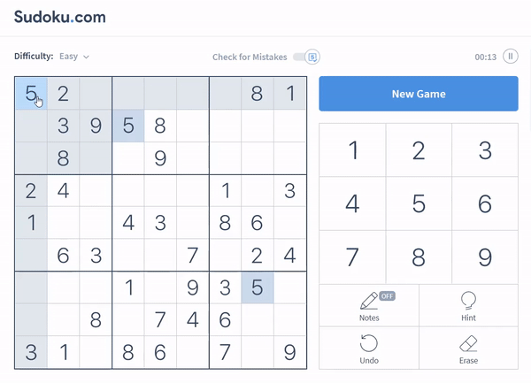

# AutomaticSudokuSolver
Automatically solves and inputs the solution into puzzles from www.sudoku.com.

## How does it work?

First you open up a puzzle of your choice from www.sudoku.com and download the html file for the page. This can be done by simply right-clicking, or pressing ctrl+s, and saving the document as "puzzle" with the file-type "Webpage, Complete" in the root of the project's directory. You should now have both a "puzzle.html" file and a "puzzle_files" folder in the same directory as the main.py file for this project. This allows the BeautifulSoup4 module to parse out the puzzle's data and input that into my backtracking sudoku solver algorithm. Once solved it's ready to input the solved data automatically so all you have to do is click the top left box in the puzzle and wait. This may take a few seconds depending on both the speed of your computer and the complexity of the puzzle. However, I've added a three second buffer to give those with the speediest of computers a little time to get their mouse in the right spot.

To recap:

  1. Find your puzzle on www.sudoku.com .
  2. Save that page with the name "puzzle" and file type "Webpage, Complete" in the same directory as the main.py file.
  3. Run the program and click the top left box of the sudoku puzzle and wait.

## Complications

1. Because www.sudoku.com uses dynamically loaded puzzles using JavaScript I couldn't use the requests module to simply get the puzzle's html from the url of the page. One solution to this would be to use the selenium web-based automated testing tool to hook into the browser's driver to wait for the content to be ready and then pass that data into BS4.

  - Pros: This would be a much cleaner solution than downloading the webpage to pass into BS4.
  
  - Cons: Selenium does not yet allow users to hook into already active browswer sessions (cleanly).
  
 2. www.sudoku.com uses svg drawings of their numbers instead of css formatted numbers which made parsing out the puzzle data a bit harder than normal. I solved this by adding a dictionary that aliased the svg pathing information for each number to the normal integer represenation.
